---

## 💫 About Me

🌍 Growth marketer & data tinkerer who loves turning small ideas into useful web tools.
I work at the intersection of **growth, data, and creative** — running experiments, building
data-driven acquisition systems, and shipping practical products along the way.

- 🔭 I’m currently working on **growth marketing experiments + data-driven acquisition systems**
- 👯 I’m looking to collaborate on **growth + analytics projects, automation workflows, and AI/data products**
- 🤝 I’m looking for help with **scaling tracking & attribution (GA4 / Pixel / server-side)** and **LTV modeling**
- 💬 Ask me about **growth strategy, funnels, A/B testing, dashboards, and marketing analytics**

---

## 🛠️ What I Do

| | |
|---|---|
| 📈 **Growth & Marketing** | Funnels, A/B testing, paid acquisition, attribution & measurement |
| 📊 **Data & Analytics** | Dashboards, experimentation, LTV modeling, light ML / data products |
| 💻 **Web & Tools** | Next.js / Node / PHP / WordPress — building small, useful web apps |
| 🎨 **Creative** | Motion, design & branding with the Adobe suite, Blender & Canva |

---

## ⚡ Currently

- 🌱 **Learning:** advanced experimentation & better data engineering practices
- 🔧 **Building:** tracking & attribution pipelines, internal dashboards
- 🧪 **Exploring:** practical AI/data products and automation workflows

---

## 🎉 Fun Facts

- 🖥️ I built a **full-screen hosted wallpaper site** so anyone can use it as a live Mac background via Plash
- 🎯 I love taking a vague idea and shipping it as a tiny working tool
- 🎨 I bounce between spreadsheets and design files in the same afternoon

---

## 🌐 Socials

---

## 💻 Tech Stack

**Languages**

      

**Web & Frameworks**

   

**Data & ML**

         

**Databases & Cloud**

   

**Creative**

       

**Tools**

 

---

## 📊 GitHub Stats

---

## ✍️ Random Dev Quote

---

## 📫 Get in Touch

Always open to interesting growth, data, or creative collaborations.

